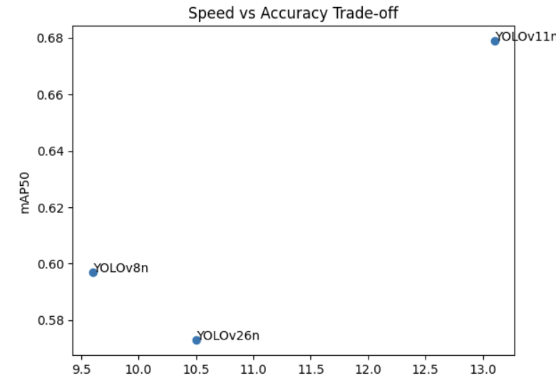

# YOLO Version Comparison Study

## Objective
Compare detection performance across different YOLO lightweight models.

## Environment
- Google Colab
- CUDA enabled GPU
- Ultralytics YOLO

## Installation

```bash
pip install -r requirements.txt


## Experimental Setup
- Dataset: Surface Defect Detection (Roboflow)
- Image size: 640
- Epochs: 100
- Batch size: 16

## Results

| Model     | mAP@50 | Inference Time (ms) |
|-----------|--------|---------------------|
| YOLOv8n   | 0.597  | 9.6                 |
| YOLOv11n  | 0.679  | 13.1                |
| YOLOv26n  | 0.573  | 10.5                |

## Speed vs Accuracy Trade-off



## Insight
YOLOv11n achieved the highest mAP@50 but required longer inference time.  
YOLOv8n showed the fastest inference performance.  
YOLOv26n demonstrated balanced but slightly lower accuracy.

## Reproducibility
Dataset is downloaded via Roboflow API.  
Roboflow API key is required to reproduce the experiment.
